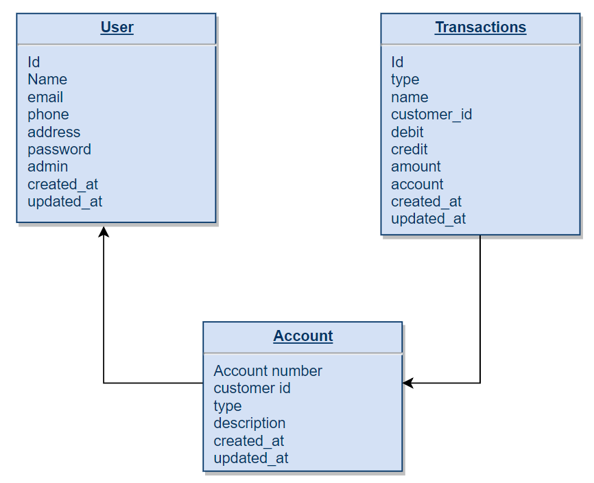
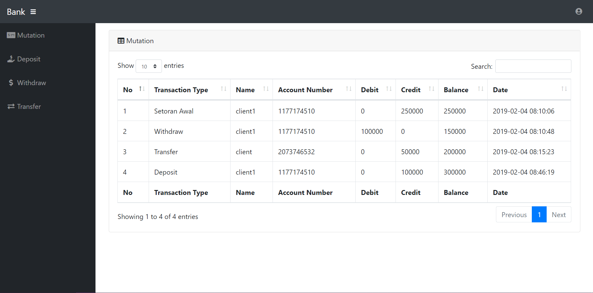
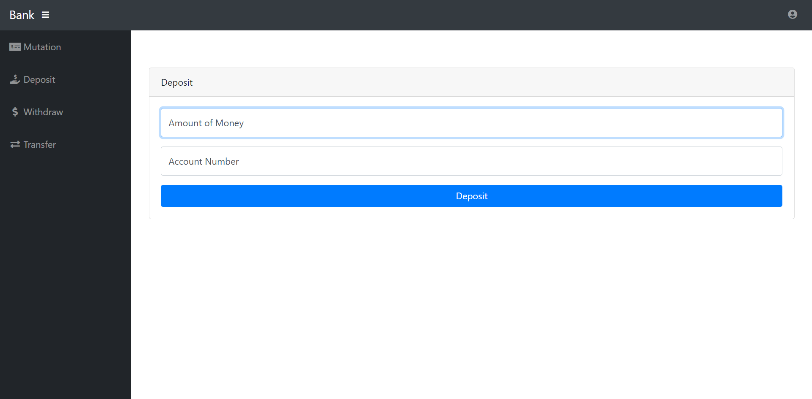
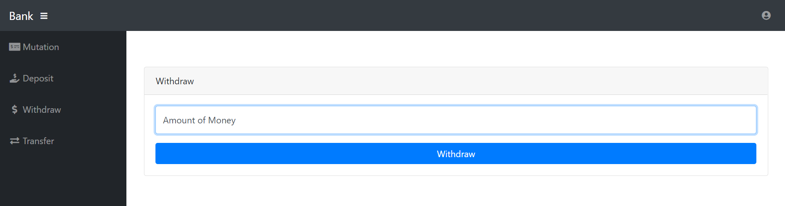
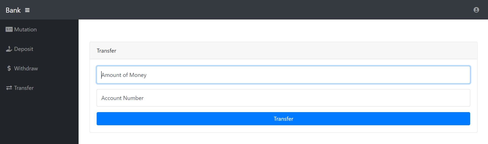
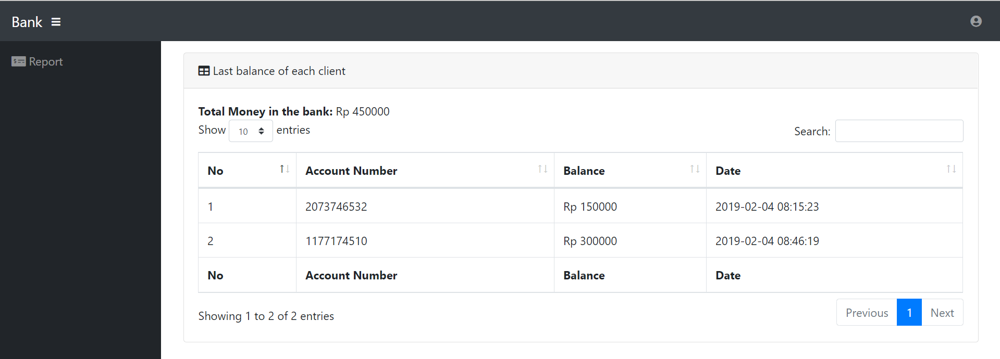

Simple Banking Application

Setiap kali client melakukan registrasi, client akan mendapatkan nomor akun sebanyak 10 digit secara acak dan menambahkan setoran awal sejumlah Rp 250.000. Database serta akun admin dapat dilihat pada migration serta seeder.
Database:
 
 
 
Tabel users:
•	Id user
•	Nama user
•	Email user
•	Phone: no. HP user
•	Address: alamat user
•	Password
•	Admin: bernilai 0 jika user = client bank dan bernilai 1 jika user=admin/manager bank. Nilai default setiap melakukan registrasi = 0
•	Created_at
•	Updated_at

Tabel accounts:
•	Account number: berupa 10 digit angka random yang didapatkan ketika melakukan register
•	Customer_id: id dari tabel users
•	Type: tipe akun
•	Description
•	Created_at
•	Updated_at

Tabel Transaksi:
•	Id transaksi
•	Type: jenis transaksi
•	Name: nama user
•	Customer_id: account number dari tabel accounts
•	Debit
•	Credit
•	Amount: saldo
•	Account: account number dari pemilik data transaksi

Fitur:
1.	Client dapat melihat data mutasi dari rekening bank
 
 
2.	Client dapat melakukan setor ke rekening bank
 
 
3.	Client dapat melakukan tarik uang pada rekening bank 
 
 
4.	Client dapat melakukan transfer ke rekening bank
 
 
5.	Admin dapat melihat saldo/uang yang terdapat pada bank
 

Saran Pengembangan Aplikasi:

•	Menambahkan verifikasi email/no.hp

•	Menambahkan verifikasi data sebelum transaksi dilakukan

•	Menambahkan notifikasi jika transaksi berhasil/gagal

•	Menambahkan halaman profil client sehingga client dapat mengupdate data dan melakukan verifikasi ulang jika diperlukan.

•	Menambahkan halaman untuk mendaftarkan/menambahkan admin
